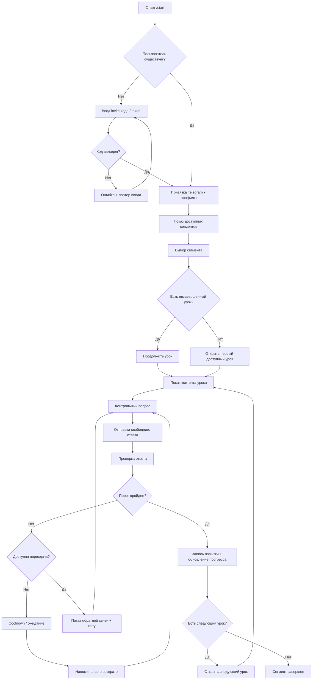
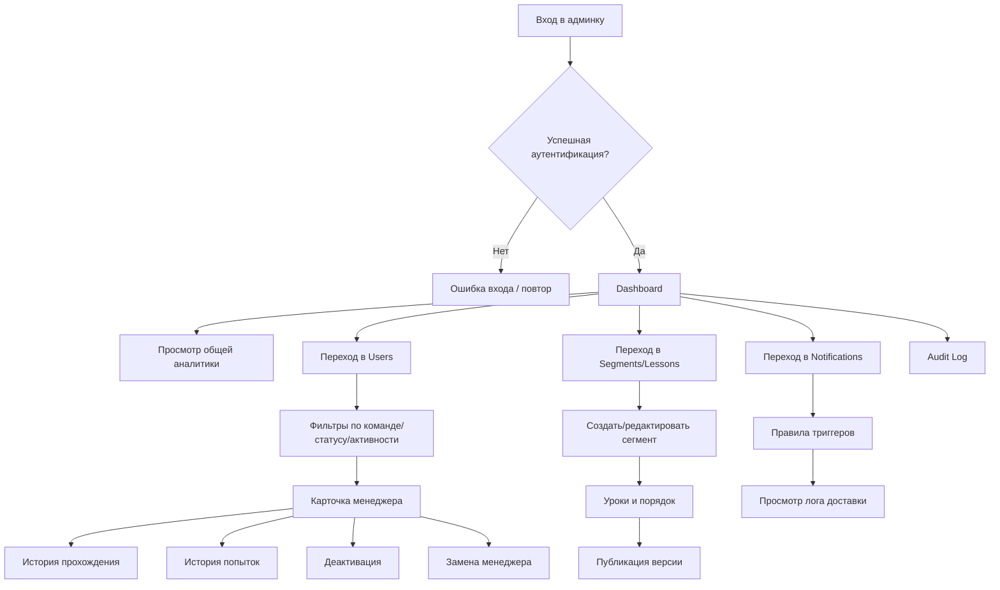

# 05 — User Flows

## 1. Manager Flow

```mermaid
flowchart TD
    A[Старт /start] --> B{Пользователь существует?}
    B -- Нет --> C[Ввод invite-кода / token]
    C --> D{Код валиден?}
    D -- Нет --> E[Ошибка + повтор ввода]
    E --> C
    D -- Да --> F[Привязка Telegram к профилю]
    B -- Да --> F
    F --> G[Показ доступных сегментов]
    G --> H[Выбор сегмента]
    H --> I{Есть незавершенный урок?}
    I -- Да --> J[Продолжить урок]
    I -- Нет --> K[Открыть первый доступный урок]
    J --> L[Показ контента урока]
    K --> L
    L --> M[Контрольный вопрос]
    M --> N[Отправка свободного ответа]
    N --> O[Проверка ответа]
    O --> P{Порог пройден?}
    P -- Да --> Q[Запись попытки + обновление прогресса]
    Q --> R{Есть следующий урок?}
    R -- Да --> S[Открыть следующий урок]
    S --> L
    R -- Нет --> T[Сегмент завершен]
    P -- Нет --> U{Доступна пересдача?}
    U -- Да --> V[Показ обратной связи + retry]
    V --> M
    U -- Нет --> W[Cooldown / ожидание]
    W --> X[Напоминание о возврате]
    X --> M
```

## 2. Admin Flow

```mermaid
flowchart TD
    A[Вход в админку] --> B{Успешная аутентификация?}
    B -- Нет --> C[Ошибка входа / повтор]
    B -- Да --> D[Dashboard]
    D --> E[Просмотр общей аналитики]
    D --> F[Переход в Users]
    D --> G[Переход в Segments/Lessons]
    D --> H[Переход в Notifications]
    F --> I[Фильтры по команде/статусу/активности]
    I --> J[Карточка менеджера]
    J --> K[История прохождения]
    J --> L[История попыток]
    J --> M[Деактивация]
    J --> N[Замена менеджера]
    G --> O[Создать/редактировать сегмент]
    O --> P[Уроки и порядок]
    P --> Q[Публикация версии]
    H --> R[Правила триггеров]
    R --> S[Просмотр лога доставки]
    D --> T[Audit Log]
```