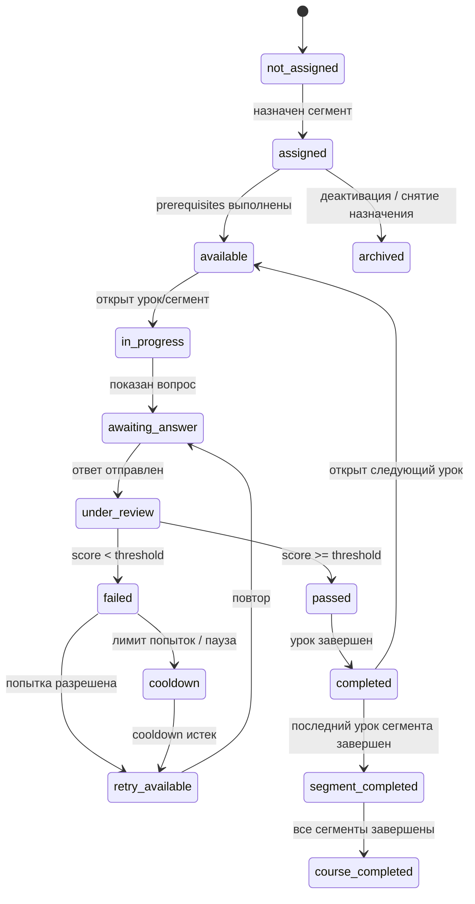

# 06 — Learning State Machine

## 1. Learning Lifecycle

```mermaid
stateDiagram-v2
    [*] --> not_assigned
    not_assigned --> assigned: назначен сегмент
    assigned --> available: prerequisites выполнены
    available --> in_progress: открыт урок/сегмент
    in_progress --> awaiting_answer: показан вопрос
    awaiting_answer --> under_review: ответ отправлен
    under_review --> passed: score >= threshold
    under_review --> failed: score < threshold
    failed --> retry_available: попытка разрешена
    retry_available --> awaiting_answer: повтор
    failed --> cooldown: лимит попыток / пауза
    cooldown --> retry_available: cooldown истек
    passed --> completed: урок завершен
    completed --> available: открыт следующий урок
    completed --> segment_completed: последний урок сегмента завершен
    segment_completed --> course_completed: все сегменты завершены
    assigned --> archived: деактивация / снятие назначения
```
