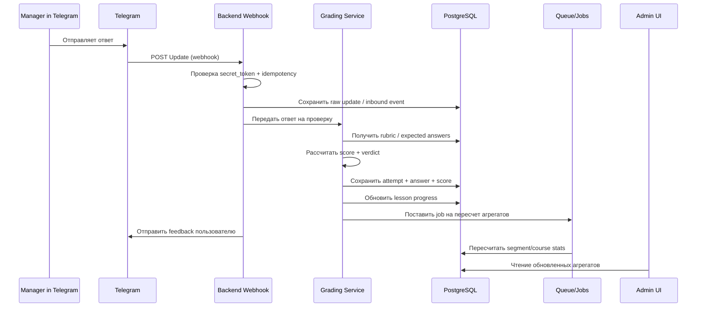

# 07 — Submit Answer Sequence

## 1. Submit Answer Flow

```mermaid
sequenceDiagram
    participant U as Manager in Telegram
    participant TG as Telegram
    participant B as Backend Webhook
    participant G as Grading Service
    participant DB as PostgreSQL
    participant Q as Queue/Jobs
    participant A as Admin UI

    U->>TG: Отправляет ответ
    TG->>B: POST Update (webhook)
    B->>B: Проверка secret_token + idempotency
    B->>DB: Сохранить raw update / inbound event
    B->>G: Передать ответ на проверку
    G->>DB: Получить rubric / expected answers
    G->>G: Рассчитать score + verdict
    G->>DB: Сохранить attempt + answer + score
    G->>DB: Обновить lesson progress
    G->>Q: Поставить job на пересчет агрегатов
    B->>TG: Отправить feedback пользователю
    Q->>DB: Пересчитать segment/course stats
    A->>DB: Чтение обновленных агрегатов
```