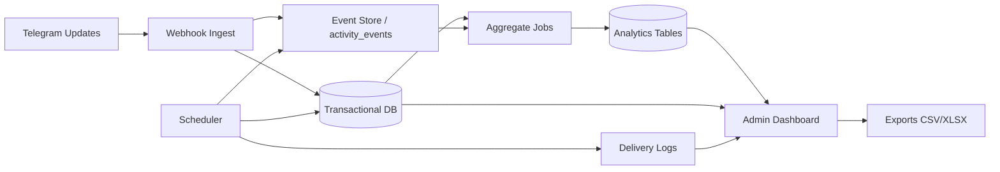

# 08 — Analytics Data Flow

## 1. Analytics Pipeline

```mermaid
flowchart LR
    TG[Telegram Updates] --> W[Webhook Ingest]
    W --> E[Event Store / activity_events]
    W --> T[(Transactional DB)]
    T --> G[Aggregate Jobs]
    E --> G
    G --> A[(Analytics Tables)]
    A --> UI[Admin Dashboard]
    T --> UI
    UI --> X[Exports CSV/XLSX]
    H[Scheduler] --> T
    H --> E
    H --> D[Delivery Logs]
    D --> UI
```